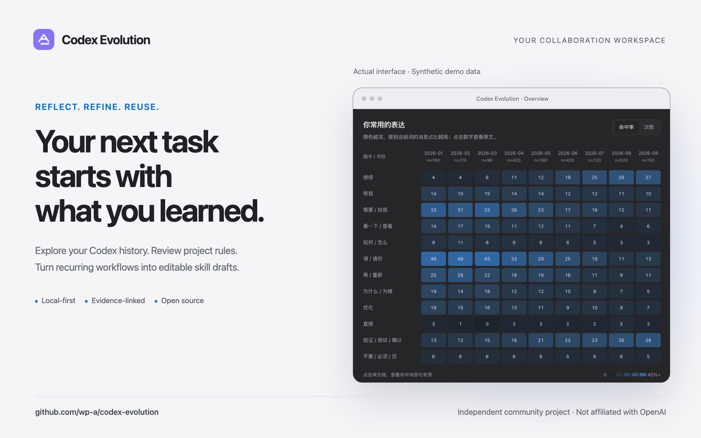
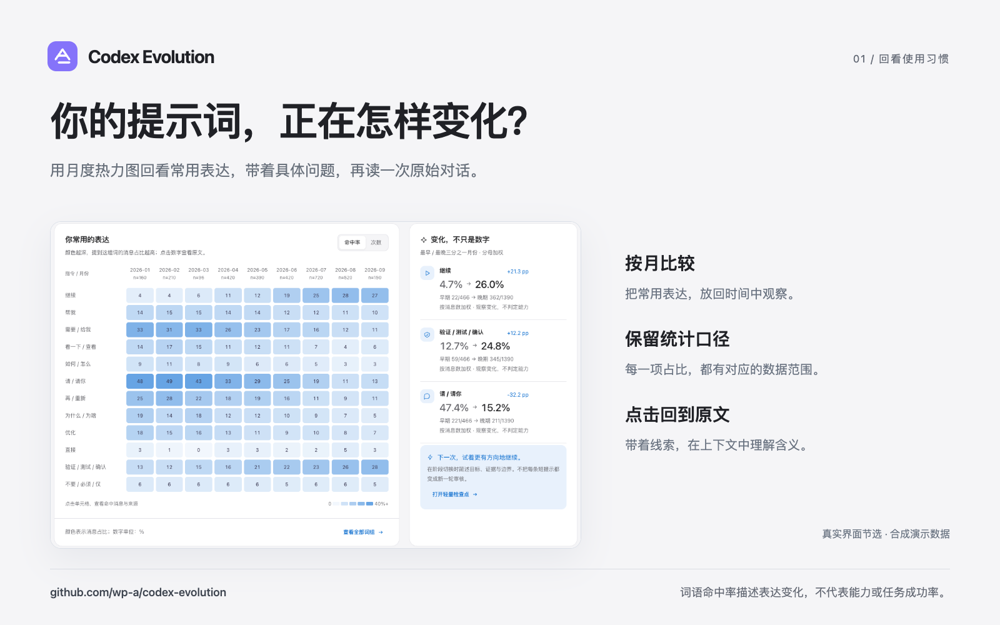
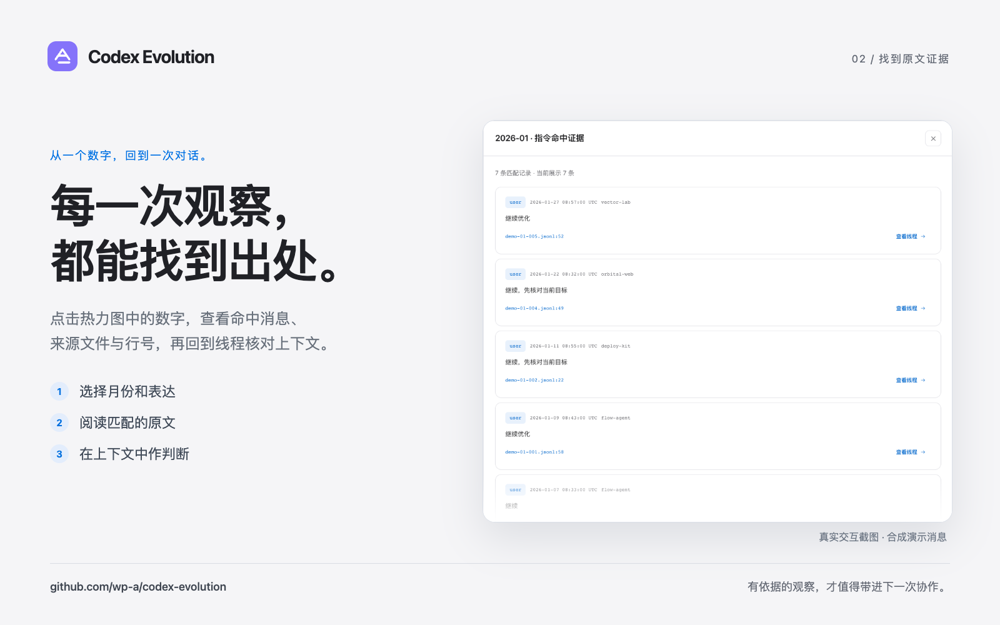
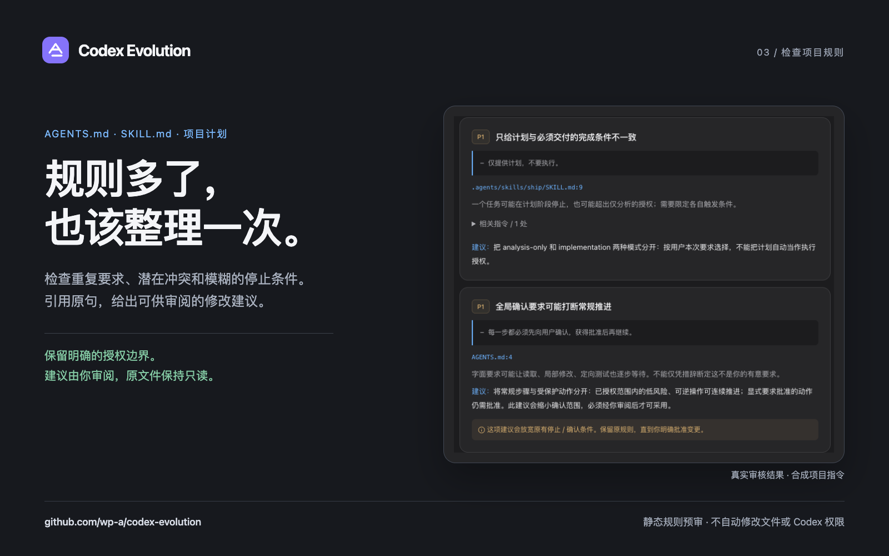
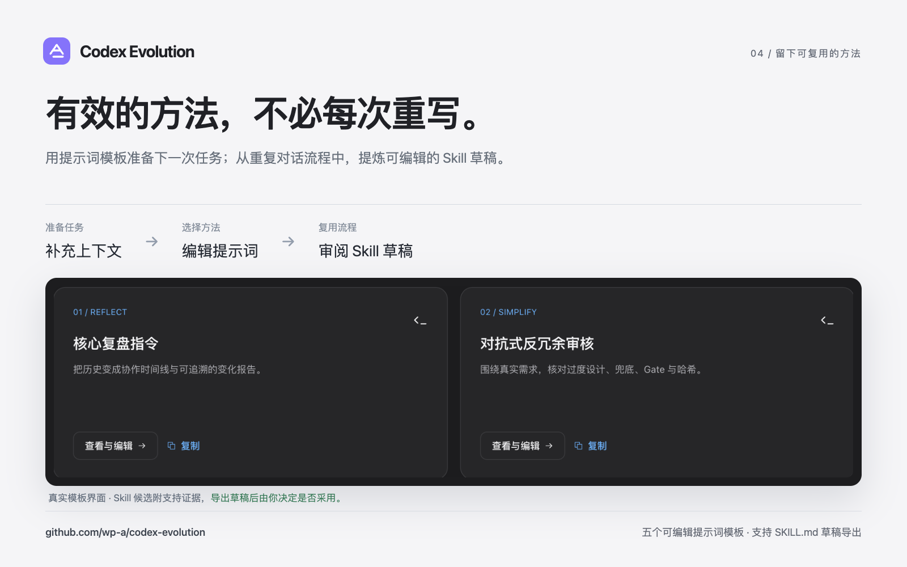

<div align="center">
  
  <h1>Codex Evolution</h1>
  <p><strong>Turn your Codex history into a clearer way to work.</strong></p>
  <p>Local-first · Zero runtime dependencies · Evidence-linked · MIT</p>
  <p><a href="README.zh-CN.md">简体中文</a> · <a href="#quick-start">Quick start</a> · <a href="docs/USAGE.md">Usage guide</a> · <a href="https://github.com/wp-a/codex-evolution/releases/latest">Downloads</a> · <a href="docs/marketing/README.md">Media kit</a></p>
</div>



**A local workspace for reviewing how you use Codex.** Explore your history, understand the evidence behind each observation, and prepare better instructions for your next task.

## What it does

| Start with a question | What you can do |
|---|---|
| How have my prompting habits changed? | Compare monthly patterns and export a retrospective report. |
| What is this observation based on? | Open original messages with source files, line numbers and thread context. |
| Do my project rules overlap or conflict? | Review `AGENTS.md`, Skill instructions and project plans with cited suggestions. |
| Which methods can I reuse? | Edit prompt templates and review evidence-supported `SKILL.md` drafts. |

The macOS-inspired interface supports light and dark themes. Start with **先看示例** to explore synthetic data, or **导入我的记录** to import local history. The interface is currently in Chinese; documentation is available in English and Chinese.

## From the author

> **Author's AI service · Promotion · WPIRONMAN AI Relay**<br>
> OpenAI-compatible API access for clients that support a custom base URL. [Visit the console for setup details](https://api.wpironman.top).<br>
> This service is run by the project author. Codex Evolution's local features do not require it; the optional built-in model connection currently uses the official OpenAI API and does not support relay configuration.

## Quick start

Requires **Python 3.10+**. Running from the checkout needs no dependency installation, Node.js, database service or API key.

```bash
git clone https://github.com/wp-a/codex-evolution.git
cd codex-evolution
python3 -m codex_evolution demo --open
```

Open `http://127.0.0.1:8765` if the browser does not open. Press `Ctrl+C` to stop. Demo mode uses synthetic data and never imports your history automatically.

To explicitly import your own local records:

```bash
python3 -m codex_evolution import "${CODEX_HOME:-$HOME/.codex}"
python3 -m codex_evolution serve --open
```

Original files remain unchanged. Imported copies are stored in `~/.codex-evolution/evolution.sqlite`, separate from Codex. For custom database paths, CLI exports, package installation and optional model setup, see the [usage guide](docs/USAGE.md).

## Screenshots

<details>
<summary>Explore the workspace — all pictured data is synthetic</summary>

| Review your habits | Follow the evidence |
|---|---|
|  |  |
| Check project rules | Prepare reusable workflows |
|  |  |

The screenshots show the Chinese interface. More images and ready-to-share assets are in the [media kit](docs/marketing/README.md).

</details>

## Privacy and scope

- **Local by default.** No automatic history import or model request. Shareable retrospective reports contain aggregate statistics; model requests require a separate preview and explicit consent.
- **Suggestions stay reviewable.** Audits cite source lines and propose changes. They do not patch files, install skills, run transcript commands or change Codex permissions.
- **Observations need context.** Word rates, short prompts and repeated workflows describe recorded behavior; they do not measure ability or prove task success. Import coverage depends on the records available.
- **Made for one trusted local user.** The HTTP service is not designed for public hosting.

## Documentation and contributing

| Read next | Contents |
|---|---|
| [Usage guide](docs/USAGE.md) / [中文快速上手](docs/QUICKSTART.zh-CN.md) | Installation, imports, CLI commands and optional model setup. |
| [Data formats](docs/DATA_FORMAT.md) / [Methodology](docs/METHODOLOGY.md) | Supported records, metrics and interpretation limits. |
| [Architecture](docs/ARCHITECTURE.md) / [Security](SECURITY.md) | Local processing, evidence handling and model boundaries. |
| [QA](docs/QA.md) / [Roadmap](docs/ROADMAP.md) | Verification records and planned work. |
| [Contributing](CONTRIBUTING.md) / [Standalone skills](skills/README.md) | Development guidance and manually adoptable review skills. |
| [Media kit](docs/marketing/README.md) / [Launch copy](docs/launch/LAUNCH_COPY.md) | Product images and ready-to-publish introductions. |

Run the core checks with:

```bash
python3 -m unittest discover -s tests -v
```

Adapter improvements, accessibility fixes and synthetic audit fixtures are welcome. Please share minimal reproductions, never private transcripts.

Version **0.1.1** · Independent community project, not affiliated with or endorsed by OpenAI.

MIT © 2026 Codex Evolution contributors.
