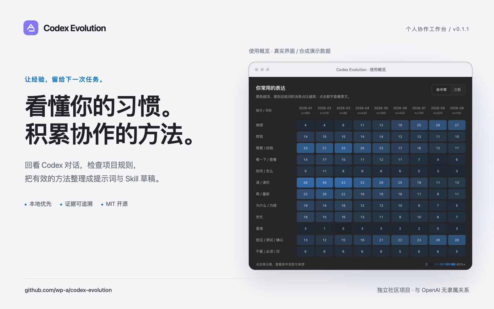
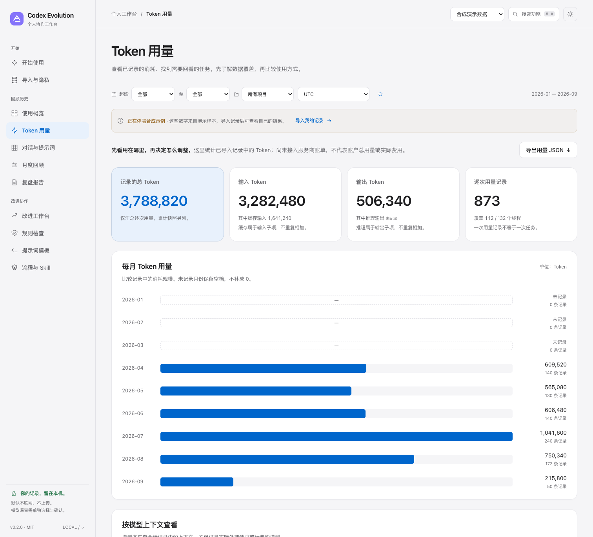
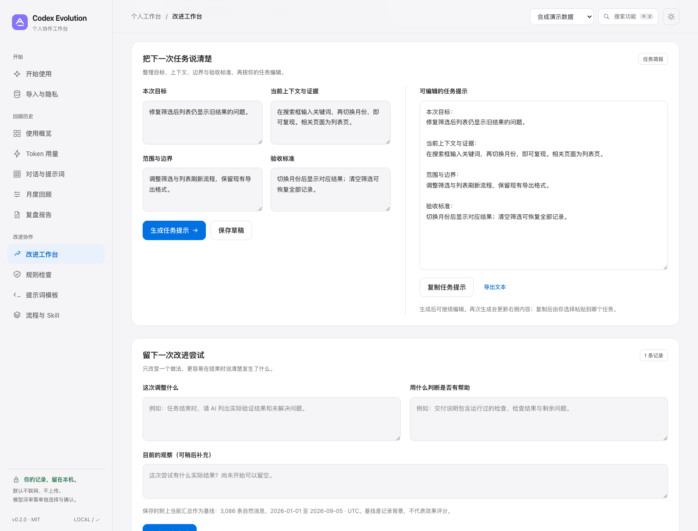

<div align="center">
  
  <h1>Codex Evolution</h1>
  <p><strong>回看与 Codex 的协作，整理下一次可用的方法。</strong></p>
  <p>本地优先 · 零运行时依赖 · 证据可追溯 · MIT 开源许可</p>
  <p><a href="README.md">English</a> · <a href="#快速开始">快速开始</a> · <a href="docs/QUICKSTART.zh-CN.md">使用指南</a> · <a href="docs/METHODOLOGY.md">统计口径</a> · <a href="https://github.com/wp-a/codex-evolution/releases/latest">下载</a></p>
</div>



## 这个项目用来做什么

**Codex Evolution 是一个在本机运行的 Codex 使用复盘与改进工具。** 导入历史后，查看提示习惯与已记录的 Token 用量，回到原文核对依据；也可以检查项目规则、准备任务简报，把下一次想尝试的改进记录下来。

| 你想了解什么 | 从这里开始 |
|---|---|
| 我使用 Codex 的方式有什么变化？ | 按月查看提示习惯与任务信号，导出复盘报告。 |
| 哪些任务用了更多 Token？ | 查看月份、模型上下文与高用量线程，并核对导入记录的覆盖范围。 |
| 这些观察是从哪里来的？ | 点击统计，查看原文、来源文件、行号与线程上下文。 |
| 项目规则是否重复或冲突？ | 检查 `AGENTS.md`、Skill 与项目计划，审阅带原文引用的建议。 |
| 哪些方法值得留到下次用？ | 编辑提示词模板，将有证据支持的重复流程整理为 `SKILL.md` 草稿。 |
| 下次任务可以怎么改进？ | 写清目标、上下文、范围与验收标准，尝试一项改变，再记录它是否有帮助。 |

打开“开始使用”，选择**先看示例**即可体验，也可以**导入我的记录**。界面采用 macOS 风格，支持明暗主题；规则检查和提示词模板无需先导入历史。

记录默认留在本机，分享复盘报告只导出汇总数据；可选模型请求需逐次预览并明确同意。产品观察记录中的协作行为，不给人的能力打分。

当前版本 **0.2.0** · 独立社区项目，与 OpenAI 无隶属或背书关系。

## 功能一览

| 你要解决的问题 | 项目中的实现 |
|---|---|
| 这个工具做什么，从哪里开始？ | 功能介绍、三步上手、真实计算的示例预览，以及导入和体验示例两个入口。 |
| 长期下来我怎么使用 Codex？ | 按月份、项目、时区筛选；指令词/任务信号热力图；消息长度、短提示、裸“继续”、加权阶段变化。 |
| Token 用量都去了哪里？ | “Token 用量”（`#usage`）展示导入记录中的月份、模型上下文与高用量线程，以及输入、输出、缓存输入、推理子项和数据覆盖；可导出 JSON 汇总。逐响应记录与旧格式累计快照分开列出。 |
| 怎样把观察变成下一次的行动？ | “改进工作台”（`#improve`）提供基于词面记录的建议；可编辑和复制四栏任务简报，记录要尝试的改变、验收标准、自己标记的“待观察／有帮助／没有帮助／暂不确定”和结果笔记，并导出 JSON。 |
| 不只看结论，还要知道依据 | 热力图点击打开命中原文，带来源文件、行号与线程；支持搜索。 |
| 人机协作进化时间线 | 月度主题线索、自然消息量、导入记录里的工具调用名称与数量；主题与阶段明确标注为规则推测。 |
| 有没有过度设计、兜底、审核、Gate、哈希？ | “规则检查”中的项目反冗余审核：输入计划，生成待核实的问题、理由与精简建议，保留有具体目的的保护。 |
| AGENTS.md / Skill 是否让我反复停下来？ | 扫描选定目录中的指令文件，检查确认、自主性、模糊停止、重叠、完成条件与技能元数据；引用原文，展示建议 diff。 |
| 梳理稳定流程，封装 Skill | 从至少 3 个独立线程找出重复阶段序列，展示支持证据，导出可编辑的 `SKILL.md` 草稿。 |
| 复用核心提示词 | 复盘、反冗余、指令审计、工作流提炼、轻量检查点 5 个完整模板，支持补充上下文、编辑、复制和导出。 |
| 复盘报告与分享 | 七项提示习惯变化、六行任务信号矩阵、月度观察线索、解读边界、长任务进度模板与流程保留建议；导出 Markdown、独立 HTML、统计 JSON、月度 CSV，生成不含原文的 PNG 分享卡。 |

## 界面预览

以下功能配图均使用**合成演示数据**。

| 回看使用习惯 | 查看原文证据 |
|---|---|
|  |  |
| 检查项目规则 | 整理可复用方法 |
|  |  |

### 看清 Token 用在哪里

查看输入、输出与缓存、推理子项，保留缺失月份；先了解覆盖范围，再回看具体任务。下图为合成演示数据。



### 准备下一次任务，记录什么方法有帮助

把目标、上下文、边界与验收标准整理成可编辑的任务提示，再留下一次改进尝试与实际观察。下图使用合成任务示例。



## 快速开始

### 下载并运行演示

需要 Python **3.10 或更高版本**：

```bash
git clone https://github.com/wp-a/codex-evolution.git
cd codex-evolution
python3 -m codex_evolution demo --open
```

浏览器打开 `http://127.0.0.1:8765`。不需要 Node、npm、GPU、外部数据库或 API Key；没有前端构建步骤。关闭服务按 `Ctrl+C`。不要直接双击包内 `web/index.html`，交互功能需要本机服务。

默认使用明确标记的**合成演示数据**：3,086 条自然消息、132 个含自然消息的线程。不会自动扫描你的个人文件。

### 先体验用量与改进两个入口

1. 打开侧栏的 **Token 用量**（`#usage`），查看月份与模型上下文分布，先看覆盖说明，再查看高用量线程。需要保留当前汇总时，使用页面上的 JSON 导出。
2. 打开 **改进工作台**（`#improve`），写下目标、上下文、范围和验收标准，点 **生成任务提示**，再点 **复制任务提示** 给下一次 Codex 任务。选一项准备尝试的改变，保存验收标准；任务结束后补充结果笔记，选择自己的判断并点 **保存结果**。

写任务简报不需要先导入历史，也不需要模型配置。演示与个人数据下的试验记录分开保存，完整操作和保存范围见[改进工作台指南](docs/IMPROVEMENT.md)。

### 导入自己的记录

```bash
python3 -m codex_evolution import "${CODEX_HOME:-$HOME/.codex}"
python3 -m codex_evolution serve --open
```

也可以在“导入与隐私”页明确输入历史目录，或拖入 JSON/JSONL。数据库放在 `~/.codex-evolution/evolution.sqlite`，不会修改 Codex 的原始历史。

重新导入同一来源会替换该来源的快照，不会不断叠加同一批记录。新增历史需要再次导入，当前没有后台文件监控。缺失、删除、未持久化、其他机器或云端独有的记录不在统计范围内。

也可从 [Releases](https://github.com/wp-a/codex-evolution/releases/latest) 下载源码或安装包。更多操作示例见[中文快速上手](docs/QUICKSTART.zh-CN.md)。

## 详细使用与数据边界

### 如何理解 Token 用量

用量页读取受支持导入记录中明确存在的 usage 字段，包括逐响应的 `token_usage_record`，按月份和来源中的模型上下文汇总。旧式 `token_count` 可能是累计快照，页面单独列出最新可用快照，不把每次快照相加，也不混入逐响应合计。

输入与输出是主要组成项，缓存输入和推理属于细分信息：如果来源已把它们包含在输入或输出中，就不能再相加一次。没有 usage 字段会显示覆盖缺口，不能当作任务消耗为零。

这里统计的是**已导入的本机记录**，不会查询账号余额、订阅剩余额度或账单，也不计算价格。Token 少不自动代表任务做得更好。支持格式与合计规则见[用量数据说明](docs/USAGE_DATA.md)。

### 怎样尝试一项使用改进

改进工作台把词面观察变成可选择的建议，并提供**目标、上下文、范围、验收标准**四栏任务简报。一次选择一项改变，写清如何判断，任务结束后用结果笔记留下依据，再由你标记是否有帮助。例如，在修复问题的简报中增加明确的验收检查，结束后记录检查是否实际完成。

建议不是自动效率评分；你的评价也不证明因果关系。点击 **生成任务提示** 或相应的保存按钮后，简报和试验记录才会保存到浏览器 `localStorage`，与导入历史数据库分开：仅当前浏览器、同一服务地址可见，换端口、主机名或浏览器会隔离，演示与个人数据也分开。清除浏览器数据前可导出 JSON 留存；导出包含自己写入的内容，分享前请检查。详见[改进工作台指南](docs/IMPROVEMENT.md)。

### 如何理解统计和复盘报告

**报告刻意不做“能力打分”。** “验证”命中率上升只能证明表达发生变化，不证明真正执行了更多测试；短提示不必然变差；出现重复流程不证明流程有效。所有统计都有分母与局限说明。

成长档案沿用总览的数据与筛选器。至少有三个活跃月份才生成前期／中期／后期对照；词面命中率按各期命中数与自然消息分母合并，长度与短提示占比则比较首末活跃月。矩阵中的空月份显示无数据；短窗口显示具体原因。四行轻协议仅供长任务节点选用，不要求逐步确认。详细定义见[统计口径](docs/METHODOLOGY.md#growth-dossier-v011)。

### 规则检查与权限边界

对“每一步都先确认”和“自主完成任务”这样的组合，项目会展示相关原句、文件、行号、可能重叠的作用域和编辑建议。不同子目录的 AGENTS 不会直接当作同时生效；Skill 的冲突提示会说明“仅在加载时”。同目录非空 `AGENTS.override.md` 优先。

建议如果缩小确认范围，会标记**涉及权限扩大，需审阅**。部署、删除数据、凭证访问等明确批准要求保留；下载制品、供应链完整性校验不会因为出现 SHA 就自动判为冗余。

**应用不自动修改 AGENTS.md，不应用补丁，不安装 Skill，不执行对话里的命令，也不改 Codex 权限配置。** 当前规则审核是静态预审，不是“没有提示就没有问题”的完整语义证明。

### 模型深审与现有 Codex 两条路径

本地功能不依赖模型。规则检查中的“准备语义深审”或报告中的“准备复盘材料”会先生成可查看、可编辑的证据材料：可以**复制给现有 Codex 会话**，也可以导出完整任务包。

另有可选的 OpenAI Responses API 通道，固定使用官方地址 `https://api.openai.com/v1/responses`，当前不支持自定义 API 地址或中转配置：

```bash
export OPENAI_API_KEY="你的 API 密钥"
export CODEX_EVOLUTION_MODEL="你有权限访问且支持结构化输出的模型名"
python3 -m codex_evolution serve --open
```

需要逐次审阅材料并明确勾选同意，才会发送。不是借用 Codex 订阅身份；没有读取 `auth.json`。模型没有执行工具，只返回结构化分析。配置本身不会触发联网；请求使用 `store: false`，但这不代表服务商的全部数据保留政策。API 调用可能收费；现有测试覆盖请求契约与异常处理，未进行付费在线推理验证。

**覆盖范围务必区分：**统计引擎处理全部已导入且支持的记录；模型复盘接收汇总与最多 36 条精选片段，不是把所有对话塞进一次请求。指令材料也有明确容量限制。基础脱敏不保证清除所有秘密，发送前仍需查看预览。

### 命令行操作

```bash
# 独立报告；HTML 可直接离线打开
python3 -m codex_evolution report --demo --format html --out report.html

# 指令审计：仅生成报告，不更改源文件
python3 -m codex_evolution audit /你的项目路径 --out audit.json

# 项目计划的反冗余审核
python3 -m codex_evolution audit examples/plan.md --plan --out plan-review.json

# 待审阅 Skill 草稿，不会安装
python3 -m codex_evolution skills --demo --out ./review-drafts

# 配置检查与测试
python3 -m codex_evolution doctor
python3 -m unittest discover -s tests -v
```

需要更换应用数据库时，把 `--db` 放在子命令前面：

```bash
python3 -m codex_evolution --db ./my-workspace.sqlite demo --port 9000
```

也可以用 `python3 -m pip install .` 安装当前源码包，然后运行 `codex-evolution demo --open`。安装与构建需要 setuptools；直接从源码运行只需 Python 标准库。

## 实现结构

后端是 Python 标准库 + SQLite；前端是原生 HTML/CSS/JavaScript，图表用 SVG/Canvas。没有 CDN、追踪代码、外部字体或额外 Agent 编排框架。界面提供明暗主题、移动端布局、原文弹窗、键盘快捷跳转和导出。 服务面向单个可信的本机用户，不用于公网托管。

## 作者推荐

> **作者的 AI 服务 · 推广｜WPIRONMAN AI 中转**<br>
> 为支持自定义 API 地址的客户端提供 OpenAI 兼容模型接入。[访问控制台，查看接入说明 →](https://api.wpironman.top)<br>
> 此服务由项目作者运营。Codex Evolution 的本地功能无需开通中转；当前内置模型请求使用 OpenAI 官方接口，不支持中转配置。

## 文档与参与

仓库包含中英文 README、MIT 许可、示例数据、完整提示词、4 个配套审核 Skill、单元/集成测试、可选浏览器测试、GitHub Actions CI、隐私说明、统计口径、架构文档与路线图。实际测试数量与执行环境见 [QA 记录](docs/QA.md)。

欢迎通过 Issue 或 PR 反馈导入兼容性、可访问性与实际使用问题。请提供合成的最小复现材料，不要上传私人对话。参与开发前可阅读[贡献指南](CONTRIBUTING.md)，配套审核方法见 [独立 Skill](skills/README.md)。

| 你需要 | 文档 |
|---|---|
| 启动、导入、导出与常见操作 | [中文快速上手](docs/QUICKSTART.zh-CN.md) · [完整命令与配置](docs/USAGE.md) |
| 理解数据来源与统计结果 | [数据格式](docs/DATA_FORMAT.md) · [统计口径](docs/METHODOLOGY.md) |
| 查看 Token 用量、准备下一次任务 | [用量数据说明](docs/USAGE_DATA.md) · [改进工作台指南](docs/IMPROVEMENT.md) |
| 理解实现或贡献代码 | [架构](docs/ARCHITECTURE.md) · [测试记录](docs/QA.md) · [贡献指南](CONTRIBUTING.md) |
| 了解边界与后续规划 | [安全与隐私](SECURITY.md) · [开发路线](docs/ROADMAP.md) |

进一步阅读：[快速上手](docs/QUICKSTART.zh-CN.md) · [数据格式](docs/DATA_FORMAT.md) · [测试记录](docs/QA.md) · [安全与隐私](SECURITY.md) · [开发路线](docs/ROADMAP.md)。

[MIT 许可](LICENSE) © 2026 Codex Evolution contributors.
